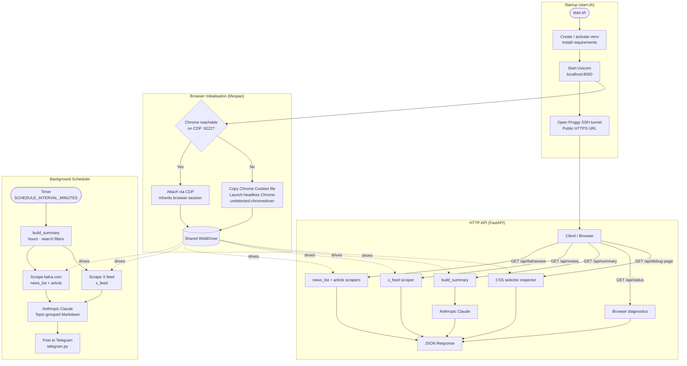

# News Agent

A FastAPI service that scrapes live news from **baha.com** and the **X (Twitter)** feed of [@MarioNawfal](https://x.com/MarioNawfal), summarises everything with **Anthropic Claude**, and auto-posts digests to a **Telegram** channel on a configurable schedule. The public API is exposed via a **Pinggy** SSH tunnel so no port-forwarding is required.

---

## Features

- Scrapes baha.com article headlines and full body text
- Scrapes the X (Twitter) profile feed
- AI-powered topic summaries using Claude (Anthropic)
- Scheduled Telegram posts with keyword and recency filters
- Public HTTPS URL via Pinggy tunnel (no configuration required)
- Headless Chrome driven by Selenium; attaches to a running Chrome instance via CDP or falls back to a headless profile

---

## Prerequisites

| Requirement | Notes |
|---|---|
| Python 3.11+ | |
| Google Chrome | Must be installed at the default macOS path |
| `ssh` | Pre-installed on macOS |
| Anthropic API key | [console.anthropic.com](https://console.anthropic.com/) |
| Telegram bot token | Create via [@BotFather](https://t.me/BotFather) (optional) |
| Pinggy token | [pinggy.io](https://pinggy.io) (optional – needed for a persistent public URL) |

---

## Setup

### 1. Clone and configure

```bash
git clone <repo-url>
cd news-agent
cp .env.example .env   # or edit .env directly
```

### 2. Edit `.env`


### 3. Dependencies

Install all dependencies manually with:

```bash
pip install -r requirements.txt
```

### 4. Start Chrome with remote debugging (recommended)

Attaching to a running Chrome instance lets the scraper inherit your logged-in cookies automatically:

```bash
/Applications/Google\ Chrome.app/Contents/MacOS/Google\ Chrome \
    --remote-debugging-port=9222
```

If Chrome is not reachable on port 9222, the app automatically falls back to a headless Chrome instance using a copy of your local Chrome cookies.

---

### 5. Running

```bash
./start.sh
```

`start.sh` will:

1. Create a Python virtual environment and install dependencies (first run only)
2. Start the FastAPI server on `http://localhost:8000`
3. Open a Pinggy SSH tunnel and print the public URL

---

## API Reference

Interactive docs are available at `/docs` (Swagger UI) and `/redoc` (ReDoc).

### Common query parameters

| Parameter | Type | Description |
|---|---|---|
| `hours` | int | Return only items published within the last N hours |
| `search` | string | Case-insensitive keyword filter on article / tweet content |

### Endpoints

#### `GET /api/bahanews`

Returns a list of baha.com articles with full body text.

#### `GET /api/xnews`

Returns recent tweets from @MarioNawfal.

#### `GET /api/summary`

Scrapes both sources and returns an Anthropic-generated topic-grouped Markdown summary.

Requires `ANTHROPIC_API_KEY` to be set.

#### `GET /api/status`

Browser connection and authentication diagnostics.

#### `GET /api/debug-page`

Inspect CSS selectors on any baha.com page. Useful for updating selectors when the site changes.

| Parameter | Description |
|---|---|
| `url` | baha.com page URL to inspect |

---

## Telegram Setup

1. Message [@BotFather](https://t.me/BotFather) → `/newbot` → copy the API token
2. Send any message to your new bot
3. Visit `https://api.telegram.org/bot<TOKEN>/getUpdates` and copy the `id` from the `chat` object
4. Set `TELEGRAM_BOT_TOKEN` and `TELEGRAM_CHAT_ID` in `.env`

The scheduler will post a formatted Markdown summary every `SCHEDULE_INTERVAL_MINUTES` minutes.

---

## Application Design – Functional Flow



### Flow description

| Phase | What happens |
|---|---|
| **Startup** | `start.sh` creates the venv, installs deps, starts Uvicorn on port 8000, then opens a Pinggy SSH tunnel and prints the public HTTPS URL. |
| **Browser init** | On FastAPI lifespan startup, the app tries to attach to a running Chrome via CDP on `:9222`. If unreachable, it copies the local Chrome `Cookies` file into a temp profile and launches a headless instance via `undetected-chromedriver`. Either way, a single shared `WebDriver` is produced. |
| **HTTP request** | Incoming requests hit the FastAPI router. Scraping endpoints (`/api/bahanews`, `/api/xnews`) drive the shared WebDriver to fetch and parse pages. `/api/summary` additionally calls the Anthropic API to produce a topic-grouped Markdown digest. |
| **Scheduler** | A background asyncio task fires every `SCHEDULE_INTERVAL_MINUTES` minutes. It calls `build_summary` (same function used by `/api/summary`), applies optional `hours` and `search` filters, then pushes the result to Telegram via the bot API. |
